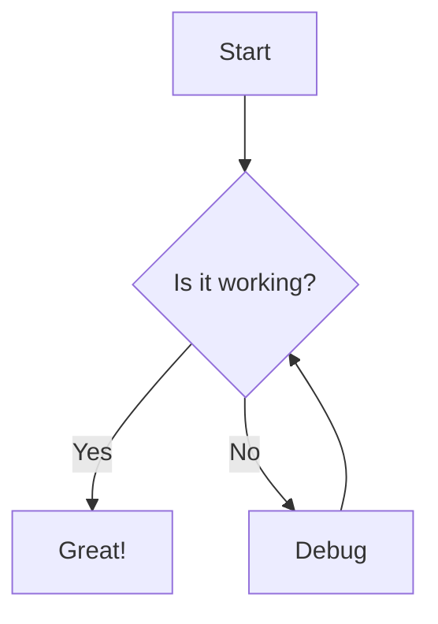
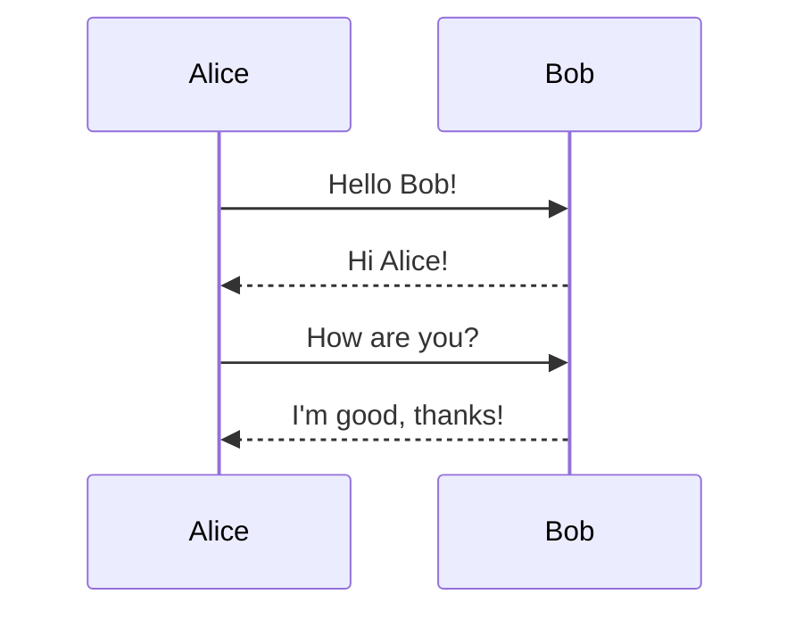
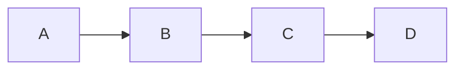

# Mermaid Diagrams

## Flowchart

```mermaid
graph TD
    A[Start] --> B{Is it working?}
    B -->|Yes| C[Great!]
    B -->|No| D[Debug]
    D --> B
```

## Sequence Diagram

```mermaid
sequenceDiagram
    participant Alice
    participant Bob
    Alice->>Bob: Hello Bob!
    Bob-->>Alice: Hi Alice!
    Alice->>Bob: How are you?
    Bob-->>Alice: I'm good, thanks!
```

## Simple Flowchart

```mermaid
graph LR
    A --> B --> C --> D
```
