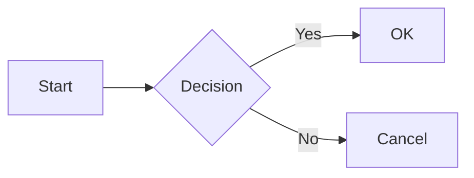
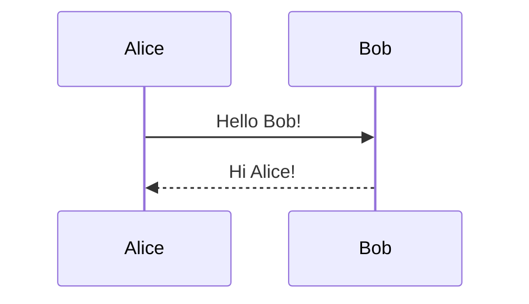

# GFM Feature Demos

- Task
  - [ ] nested task
  - [x] nested task
- Numbered list
  1. Sub list 1
  1. Sub list 2
- Text formatting: ~~deleted text~~, **bold**, _italic_, **_both_**, `code`,
  ~~**_`all formats`_**~~.
- HTML:
  - <u>underline</u>, <span style="color:orange;">orange</span>,
    <strong>strong</strong>, <em>emphasized</em>, <mark>marked</mark>,
    <ins>inserted</ins>, <del>deleted</del>, <code>code</code>
  - H<sub>2</sub>O (subscript), E=mc<sup>2</sup> (superscript)

Inline math $a^2 + b^2 = c^2$, and $\frac{a^2}{\sqrt{2}}$.

Cauchy-Schwarz inequality

$$
\begin{equation}
\left( \sum_{i=1}^n a_i b_i \right)^2 \le
\left( \sum_{i=1}^n a_i^2 \right)
\left( \sum_{i=1}^n b_i^2 \right)
\end{equation}
$$

> block quote

```javascript
// fenced code
const greet = () => console.log("Hello!");
```

```diff
+ added line
- removed line
```

## Diagrams





## Links

Auto link: https://github.com

[Inline](https://google.com) and [anchor][gg].


[gg]: https://google.com

| Feature      | OK? |
| ------------ | :-: |
| `Tables`     |  ✓  |
| **Formated** |  ✓  |
